# 50 Command linux
Tugas 50 Command Linux/Termux

### 1.pwd
Menampilkan lokasi direktori saat ini.
Contoh:
pwd
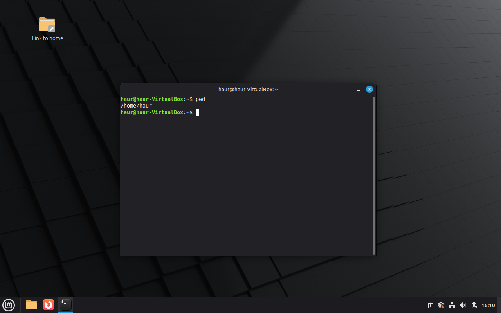
##2.ls
Menampilkan isi directori.
contoh:
ls
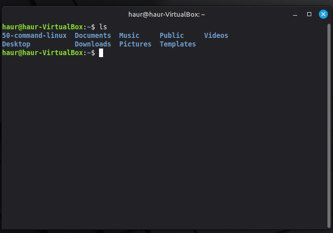

### 3.cd
Berpindah ke directori lain.
contoh:
cd dokuments
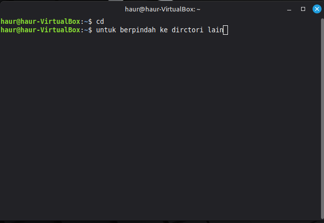

### 4. mkdir
membuat directori baru
contoh mkdir tes
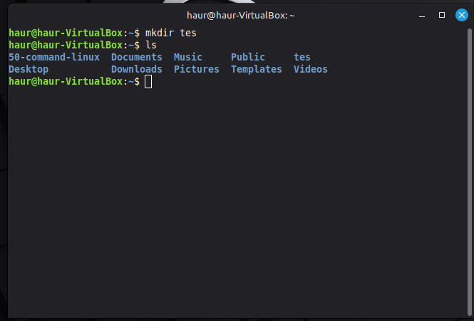

### 5.rmdir
Menghapus directori yang kosong.
contoh:
mrdir folder_baru
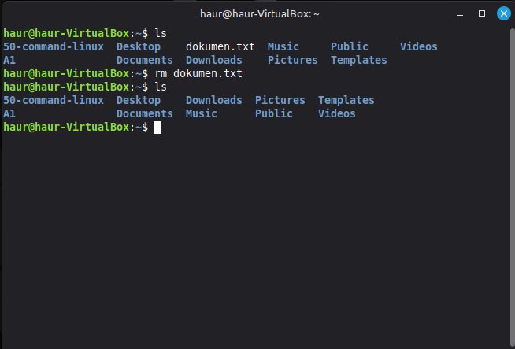
### 6.touch
membuat file kosong.
contoh:
touch file.txt

### 7.cp
Menyalin file atau directori
contoh:
cp file.txt file_backup.txt

### 8.mv
Memindahkan atau mengganti nama file.
contoh:
mv file.txt dokumen.txt
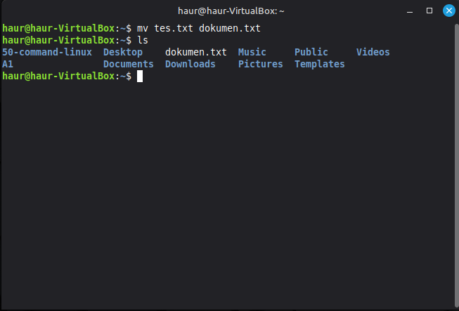
### 9.rm
menghapus file.
contoh:
rm file.txt

### 10.cat
Menampilkan isi file.
Contoh:
cat README.md
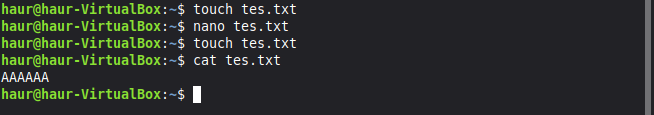
### 11.head
Menampilkan beberapa baris awal dari file.
Contoh:
head READMe.md

### 12.tail
Menampilkan beberapa baris terakhir dari file.
contoh:
tail.README.md
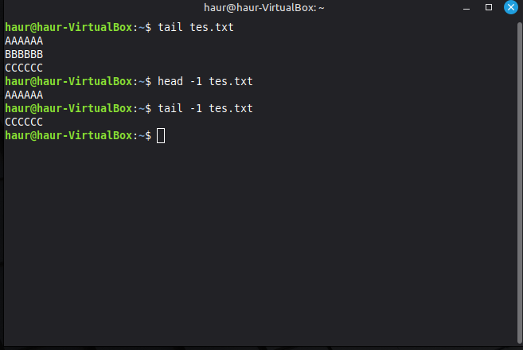
### 13.less
Menampilkan isi file secara bertahap.
contoh:
less README.md
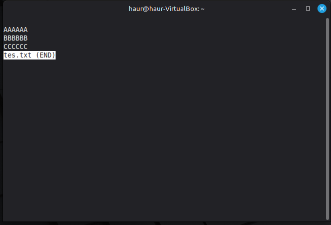
### 14.clear
Membersihkan tampilan terminal.
contoh:
clear
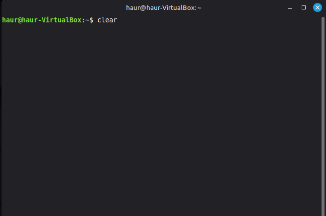
### 15.echo
Menampilkan teks pada terminal.
contoh:
echo"Hello Linux"
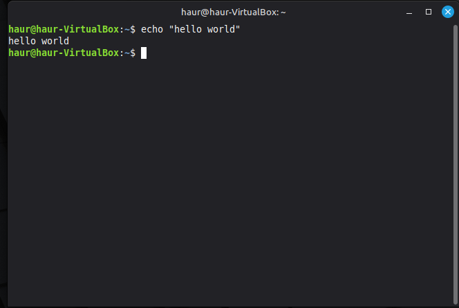
### 16.whoami
Menampikan nama pengguna yang sedang aktif.
contoh:
whoami
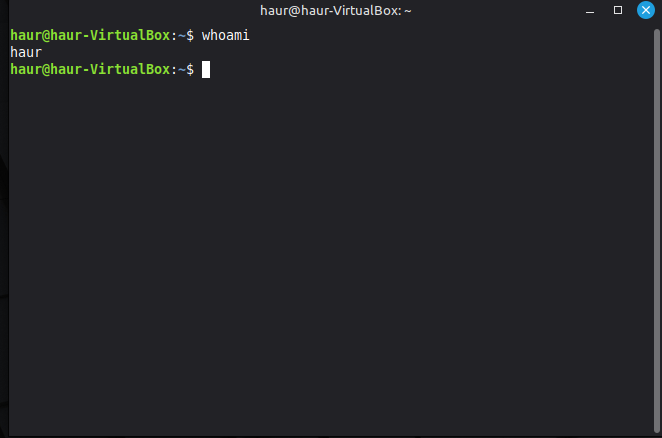
### 17.hostname
Menampilkan nama komputer.
contoh:
hostname
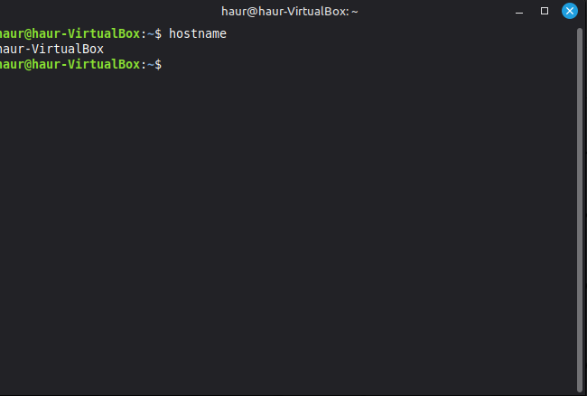
### 18.uname
Menampilkan informasi sistem linux.
contoh:
uname -a
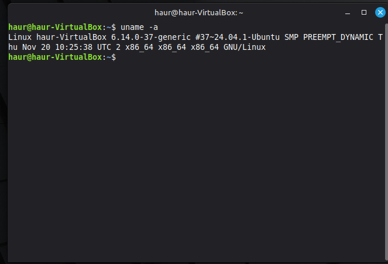
### 19.date
Menampilkan informasi site linux
contoh:
date
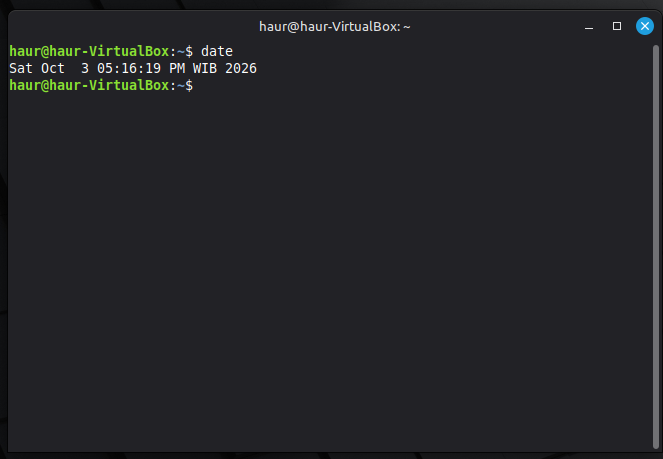
### 20.cal
Menampilkan kalender
contoh:
cal
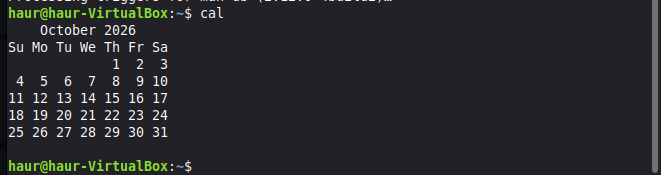
### 21.history
Menampilkan riwayat command yang pernah dijalanakan.
contoh:history

### 22.man
menampilkan manual atau panduan penggunaan command.
contoh:
man ls
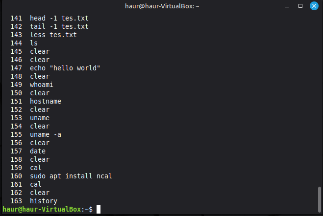
### 23.which
Menampilkan manual atau panduan penggunaan command.
contoh:
which git
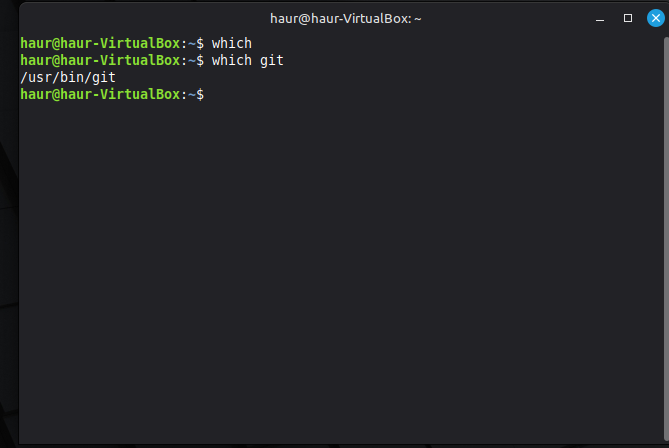
### 24.find
Mencari file atau direktori.
contoh:
find.-name:"README.md"
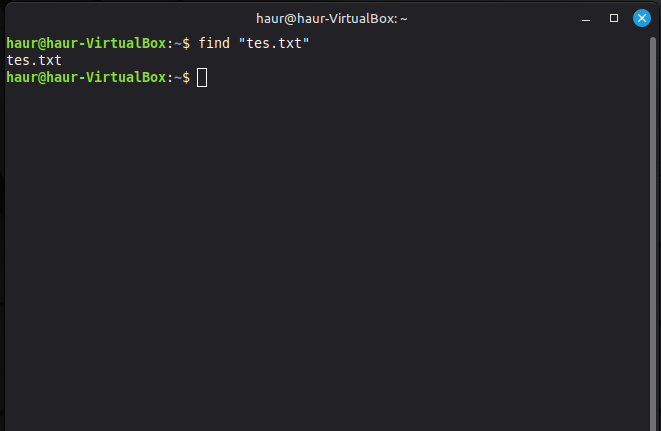
### 25.grep
Mencari teks tertentu dalam file.
contoh:
grep "linux"README.md
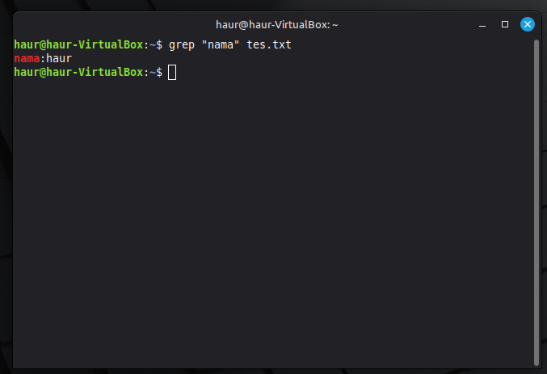
### 26.sort
mengurutkan isi teks.
contoh:
sort daftar.txt
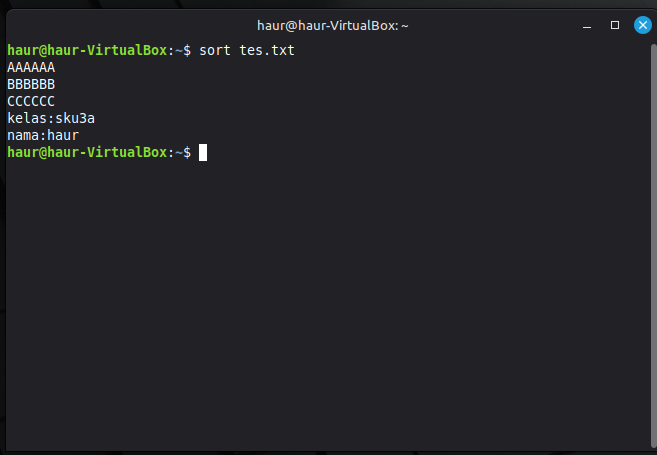
### 27.wc
Menghitung jumlah baris,kata,dan karakter.
Contoh:
wc README.md
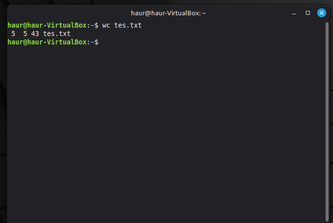
### 28.diff
Membandingkan isi dua file.
contoh:
diff file1.txt file2.txt
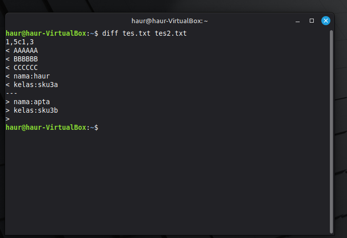
### 29.chmod
Mengubah izin akses file.
contoh:
chmod+x script.sh

### 30.chown
Mengubah pemilik file atau direktori
contoh:
sudo chown user file.txt
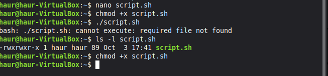
### 31.df
Menampilkan penggunaan ruang penyimpanan.
contoh:
df -h
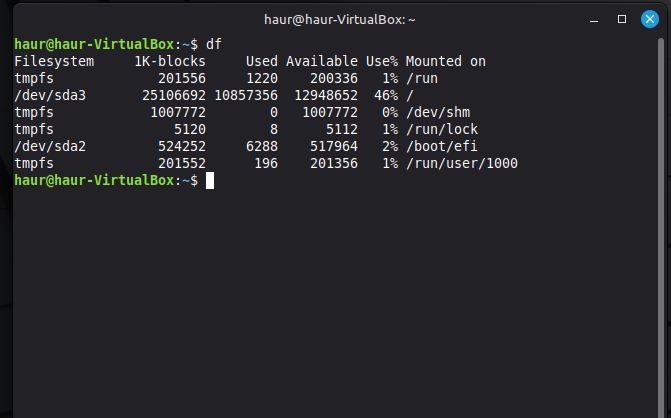
### 32.du
Menampilkan ukuran file directori.
contoh:
du -h
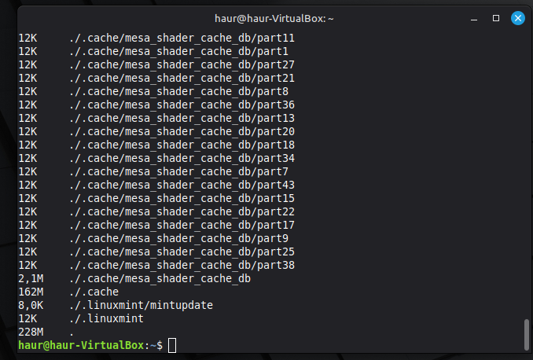
### 33.free
Menampilkan penggunaaan memori RAM.
contoh:
free -h

### 34 ps
Menampilkan proses yang sedang dijalankan.
contoh:
ps
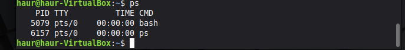
### 35.top
menampilkan proses dan penggunaaan sumber daya secara real-time.
contoh:
top
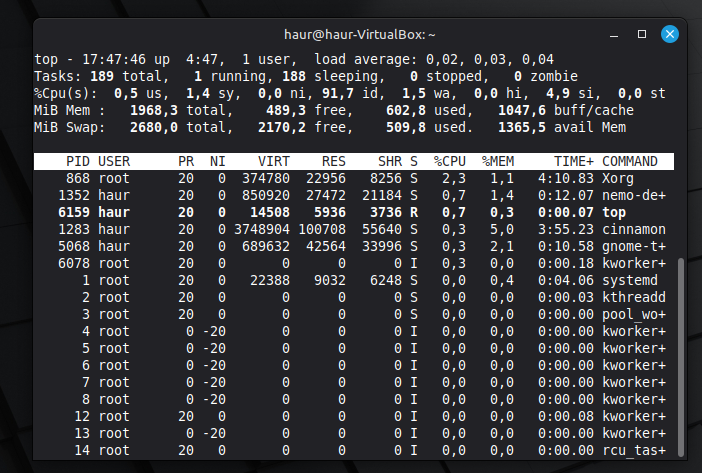
### 36.kill 
Menghentikan prosen berdasarkan nomor proses.
kill 1234
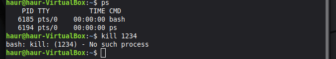
### 37. uptime
menmapilkan lama sistem telah berjalaan.
contoh:
uptime
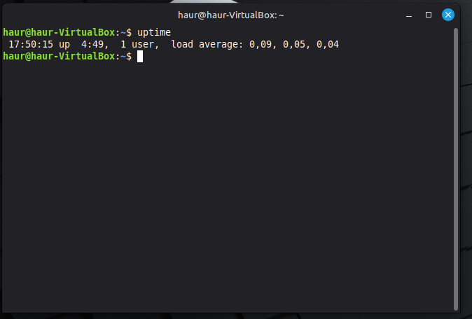
### 38. ip
menampilkan atau mengatur informasi jaringan.
comtoh:
ip sr
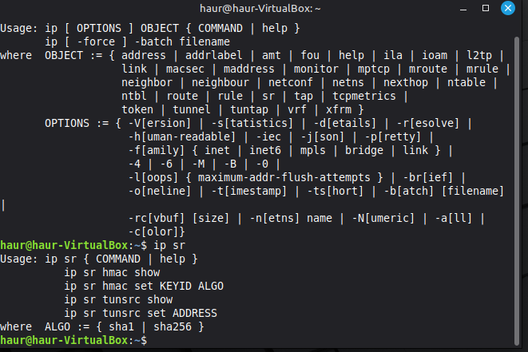
### 39.ping
menguji koneksi ke suatu alamat internet.
contoh:
ping google.com
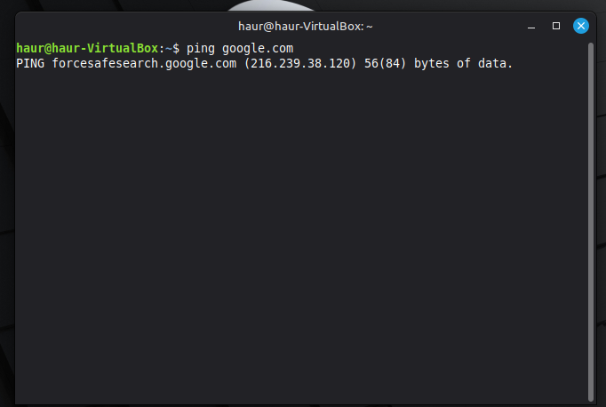
### 40.curl
memgambil dta dari alamat internet.
contoh:
curl https://example.com
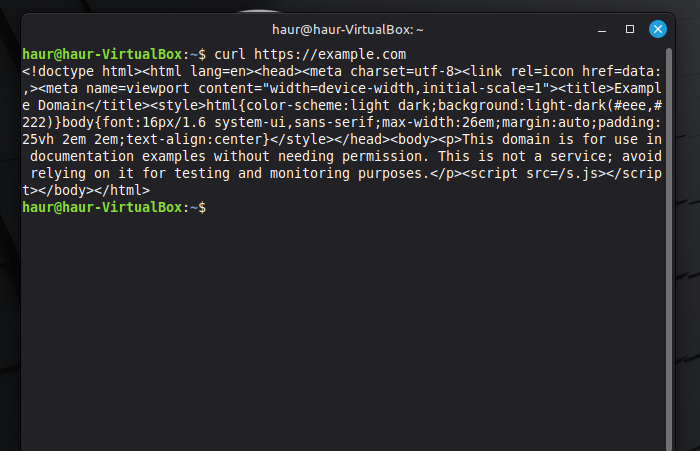
### 41.wget
megunduh file dari internet.
contoh:
wget https;//example.com/file.txt
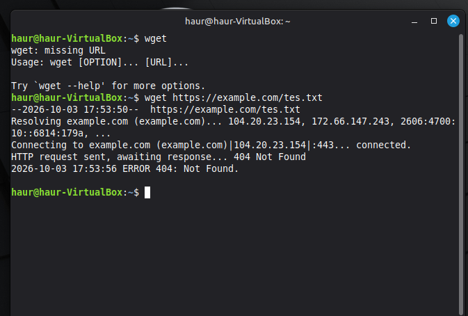
### 42. sudo
menjalankan command dengan hak akses administrator.
contoh:
sudo apt update
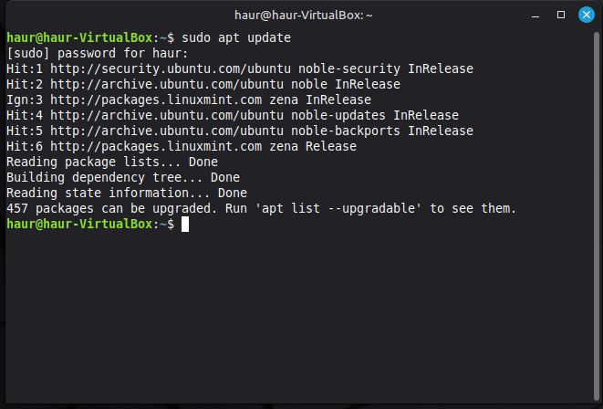
### 43.apt
mengelola paket atau software pada sistem berbasi Debian/ubuntu.
contoh:
sudo apt update

### 44.passwd
mengubah password pengguna.
contoh:
passwd
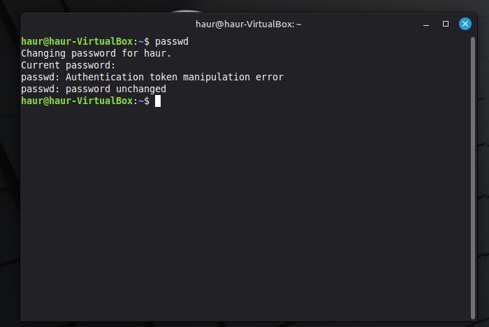
### 45.env
menmpilkan enviroment variable.
contoh:
env
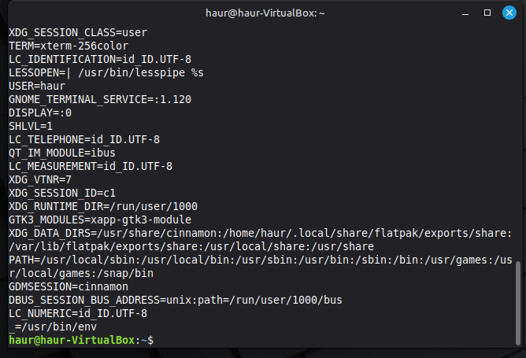
### 46. export
membuat atau mengubah enviroment variable.
contoh:
export NAMA="linux"
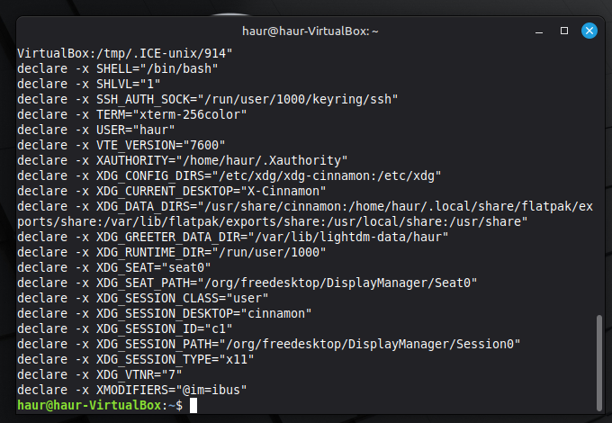
### 47.tar
membuat atau mengestrak arsip.
contoh:
tar -czvf backup.tar.gz folder
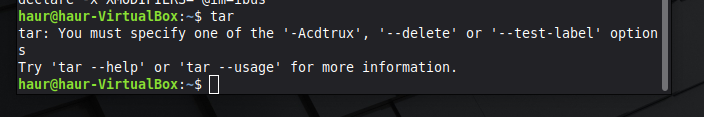
### 48.zip
membuar file arsip ZIP.
contoh:
zip -r backups.zip folder
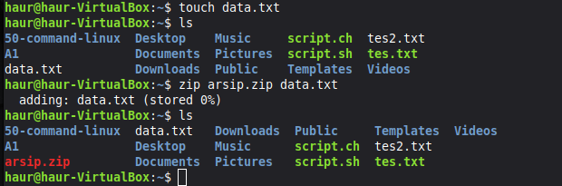
### 49 unzip
mengestrak file ZIP.
contoh:
unzip backup.zip
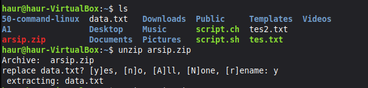
### 50.git
digunakan untuk mengelola dan mencatat perubahan pada project menggunkan Git.
contoh:
git --version
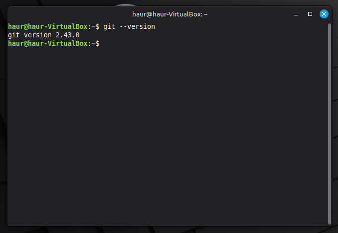
##nama : haur apta nur syahda
##nim :0901382530135
##kelas :sku3a
